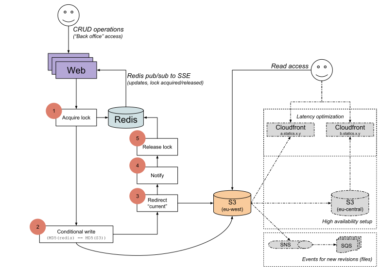

## Characteristics

Expensive to write due to coordination in order to prevent concurrent conflicting writes. Cheap and reliable to read due to easily replicated and, for those that do not require strict _read your own write_ semantics, latest version eventually available at well known URL.

## About

Statics is Heroku friendly "port" of [Pinterest's Config v2](http://engineering.pinterest.com/post/112895488589/serving-configuration-data-at-scale-with-high)
and as such it is a service for read intensive rather than write intensive workloads.

### Differences from Pinterest's Config v2

* Redis instead of Zookeeper
   * (for coordination and broadcasting changes)
* Expose the latest revision of each document at a "known URL"
   * (using AWS S3 webpage redirects)
* Stores any type of content
   * (binary data + mime type)

### Similarities to Pinterest's Config v2

* Immutable append only storage
  * (to benefit from S3's "read-after-write" consistency for new files)
* New versions are written under a per document write lock
  * (managed as a key in Redis)

### Storage

* General layout
   * `[domain][separator][type][separator][id][separator][qualifier=[revision]|current]`
* S3
   * `[domain]/[type]/[id]/[revision]`
   * `[domain]/[type]/[id]/current -> [revision]`
      * (using [AWS S3 webpage redirect](http://docs.aws.amazon.com/AmazonS3/latest/dev/how-to-page-redirect.html))
* Redis:
   * `[domain]:[type]:[id]=[revision]`
   * `lock:[domain]:[type]:[id]`
      * (written with expiration)

#### S3 configuration

The S3 bucket should be configured with
* Static website hosting
   * This is required to have the `current` revision redirect to the latest actual revision
* Versioning
   * This adds an additional saftey net by enabling you to revert to previous versions of objects
   * Versioning also allows you to iterate through the revisions of an object by stepping through the metadata of the `current` revision
   * Versioning is a pre-requeisite for bucket-to-bucket replication but need not be enabled from the start if you do not intend to use replication from the start. However adding replication later will [not replicate existing objects](https://docs.aws.amazon.com/AmazonS3/latest/dev/crr-what-is-isnot-replicated.html).
   * Optional: add a lifecycle configuration that expires old versions
      * The number of days that old versions are retained defines implicilty defines how much history of revisions you can retrieve by looking at the metadara for old versions of the `current` revision.
